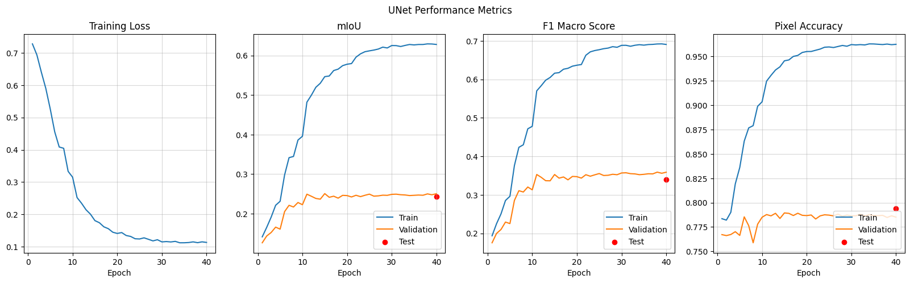
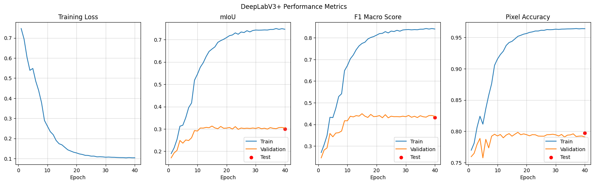
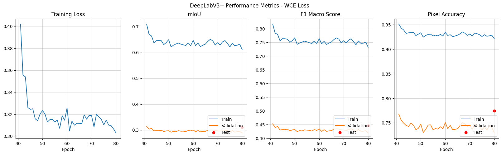
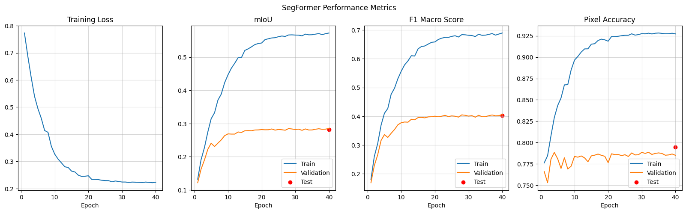
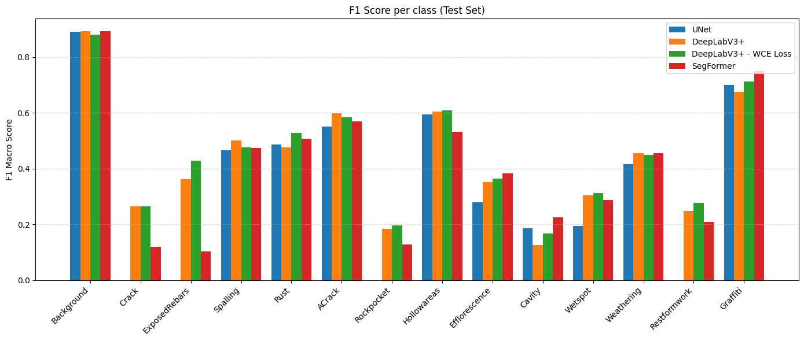
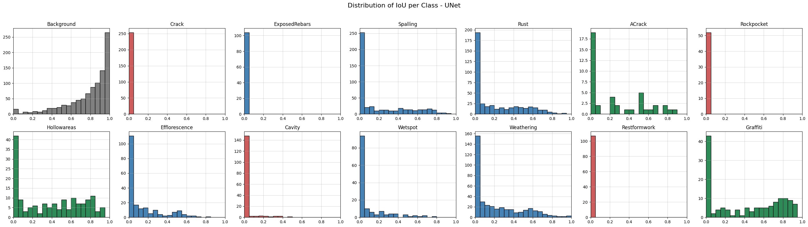
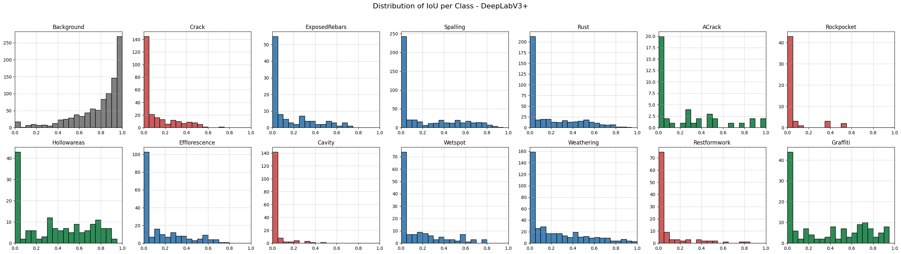
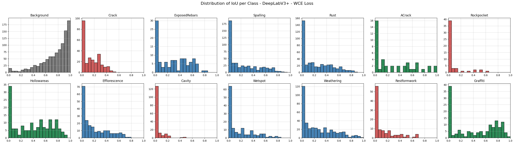
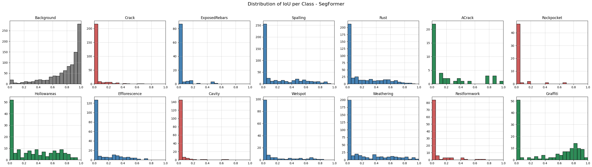

# Introducción
El objetivo del presente proyecto es realizar fine tuning de distintos modelos de segmentación semántica con niveles crecientes de complejidad, y comparar su desempeño sobre imágenes de defectos en estructuras de hormigón. El foco se centra en en la evaluación de la segmentación semántica de diferentes tipos de daños superficiales (fisuras, corrosión, desprendimientos, entre otros), sin abordar por el momento la cuantificación superficial ni la evaluación estructural, debido a la falta de información de referencia (ground truth) para esa etapa. Este trabajo servirá como prueba de concepto y base metodológica para un desarrollo posterior más amplio en el marco de la tesis de maestría. Los modelos en cuestión son indicados a continuación:

- UNet (CNN)
- DeepLabV3+ (CNN con ASPP)
- SegFormer-B0 (Encoder basado en transformers, decoder tipo MLP)

# Datos

## Dataset
Se utilizó el conjunto DACL10k, que contiene aproximadamente 9.920 imágenes con anotaciones de segmentación semántica multiclase (13 clases de defectos y 6 componentes estructurales). Este dataset presenta variedad de condiciones reales de inspección en puentes, lo que lo hace adecuado para evaluar la robustez de los modelos. Las clases de defectos son listadas a continuación:

`'Crack', 'ACrack', 'Wetspot', 'Efflorescence', 'Rust', 'Rockpocket', 'Hollowareas', 'Cavity', 'Spalling', 'Graffiti', 'Weathering', 'Restformwork', 'ExposedRebars'`

El preprocesamiento de los datos consistió en los pasos detallados a continuación.

## Preprocesamiento de datos

### Desestimación de clases de elementos estructurales
Las clases `'Bearing', 'EJoint', 'Drainage', 'PEquipment', 'JTape', 'WConccor'` fueron desestimadas debido a que correpsonden a elementos estructurales y por tanto no aportan valor para el objetivo de este proyecto.

### Elección en base a prioridad en clases solapadas
Dado que el dataset en cuestón contiene etiquetas multiclase, cada píxel puede tener más de una clase asociada. Con el objetivo de facilitar la utilización de los modelos en cuestión a partir de frameworks conocidos, y debido a que solo el 3.15% de los píxeles presentan más de una clase asociada, se condideró únicamente la clase más importante de todas las presentes para estos casos. El orden de prioridad considerado fue elegido en base a la importancia de los defectos en una estructura de hormigón y es presentado a continuación.

`Crack > ExposedRebars > Spalling > Rust > ACrack > Rockpocket > Hollowareas > Efflorescence > Cavity > Wetspot > Weathering > Restformwork > Graffiti`

### Conversión de etiquetas a máscaras
DACL10k contiene etiquetas en formato JSON. Todas ellas fueron convertidas a máscaras en formato PNG de un solo canal con valores entre 0 y 13, donde 0 corresponde a la clase `background`.

### Separación en Entrenamiento / Validación / Testeo
Dado que el dataset de testeo original no contaba con etiquetas, el mismo fue desestimado, utilizando entonces el dataset de validación como dataset de testeo. Luego, el dataset de entrenamiento original fue dividido en conjuntos de entrenamiento y validación. Esta división fue realizada de manera aleatoria pero buscando que los nuevos conjuntos presenten ratios entrenamiento/validación por clase similares a los originales de manera de mantener el dataset balanceado. El resultado final consistió en un 5895 muestras de entrenamiento, 1040 muestras de validación,y 244 de testeo. Los ratios de cada clase entre entrenamiento y validación son resumidos en la siguiente tabla.

  |Clase|Ratio original| Ratio final |
  | :--- | :--------------:| :-------------:|
  |Crack|0.1471|0.1788|
  |ExposedRebars| 0.1345|0.1856|
  |Spalling| 0.1462|0.1763|
  |Rust| 0.1348|0.1739|
  |ACrack| 0.1265|0.2029|
  |Rockpocket| 0.1672|0.1604|
  |Hollowareas| 0.1413|0.1645|
  |Efflorescence| 0.1353|0.1724|
  |Cavity| 0.1406|0.1797|
  |Wetspot| 0.1492|0.1812|
  |Weathering| 0.1450|0.1839|
  |Restformwork| 0.1865|0.1593|
  |Graffiti| 0.1836|0.1691|

# Entrenamiento

## Modelos

### UNet
Red convolucional clásica con una parte que reduce la imagen para encontrar patrones y otra parte que la vuelve a ampliar para generar la máscara final. Utiliza skip connections entre ambas partes para conservar detalles finos mientras aprende información más profunda.
### DeepLabV3+
Combina varias mejoras que le permiten entender mejor distintos tamaños y formas de defectos: un módulo especial (ASPP) que ayuda a captar información a varias escalas, una estructura más profunda de encoder–decoder, similar a UNet pero más avanzada.
### SegFormer-B0
Es un modelo basado en transformers, que funcionan muy bien para captar relaciones globales en una imagen. Tiene:
- Un sistema que divide la imagen en pequeñas regiones que se analizan de forma jerárquica.
- Un decodificador liviano y eficiente.
- Buena capacidad para entender el contexto completo de la imagen sin perder detalles importantes (transformer)

## Configuración de entrenamiento
Se realizó un entrenamiento end to end para los 3 modelos, utilizando pesos obtenidos de pre-entrenamientos con ImageNet. Los parámetros de entrenamiento escogidos fueron los siguientes.

- **Épocas**: 40
- **Función de pérdida:**
    - General: CrossEntropyLoss
    - DeepLabV3+: Se experimentó con Weighted Cross Entropy (WCE) en una segunda ronda de entrenamiento
- **Optimizer:** Adam
- **Learning rate scheduler:** ReduceLROnPlateau (LR se disminuye a la mitad cuando la pérdida del conjunto de validación no disminuye por 3 épocas)
- **Métricas:**
    - Mean IoU (promediado entre clases)
    - Macro F1 Score (F1 promediado entre clases)
    - Global Pixel Accuracy
- **Transformaciones:**
    - Redimensinoamiento a 512×512
    - Normalización específica compatible con ImageNet

**Nota:** Convertir las imágenes a un tamaño fijo es necesario para el batching (todas las imágenes de un batch pertenecen a un mismo tensor) así como para operaciones internas de los modelos preentrenados. Asimismo, la normalización es necesaria para alinear nuestros datos con los utilizados durante el preentrenamiento (ImageNet).

### Weighted Cross-Entropy (DeepLabV3+)
Dado que DeepLabV3+ generaba los mejores resultados, se eligió dicho modelo para realizar una segunda ronda de entrenamiento modificando la función de pérdida. De esta manera, se entrenó dicho modelo por 40 épocas más, continuando desde el último checkpoint de la primera ronda de entrenamiento. La función de pérdida utilizada fue WeightedCrossEntropy (WCE), la cual multiplica la pérdida de cada píxel por un peso específico por clase, lo que permite darle más importancia a clases menos representadas. Si bien es verdad que todas las clases están representadas en proporciones similares a nivel de imágenes, las clases correspondientes a defectos más locales o puntuales (`crack, cavity, etc`) estarán naturalmente menos representadas que clases correspondientes a defectos más grandes o incluso a la clase `background`. Entonces, para considerar este desbalance natural, se calculó la frecuencia de cada clase como la cantidad total de píxeles pertenecientes a la misma dividido la cantidad total de píxeles, y se asignó un peso igual al inverso de dicha frecuencia.

# Resultados
## Métricas
### Mean Intersection over Union (mIoU)
IoU es utilizada para cuantificar qué tan bien las máscaras predichas coinciden con las reales en tamaño y ubicación. mIoU corresponde al IoU promedio sobre todas las clases.

$$
IoU = \frac{TP}{TP + FP + FN}
$$

### Macro F1 Score
Media armónica entre precision y recall, siendo:
- $Precision:$ Cantidad de predicciones realizadas que son efectivamente correctas $(\frac{TP}{TP+FP})$. Una precisión alta significa que el modelo no alucina defectos donde no los hay.
- $Recall:$ Cantidad de defectos efectivamente detectados $(\frac{TP}{TP+FN})$. Un valor alto de recall significa que el modelo no pierde muchas detecciones.
- $F1:$ Media armónica entre precision y recall. Se utiliza para contemplar precision y recall de manera integrada. Para el problema en cuestión, muchos falsos positivos (baja precisión) implica que se está prediciendo más daño del que realmente tiene la estructura, lo que podría resultar en costos innecesarios en un ambiente real. Análogamente, muchos falsos negativos (baja recall) implica que muchos defectos no son detectados, lo que podría resultar en un riesgo de seguridad. Para el presente proyecto se considera que ambos riesgos tienen igual costo, por lo que se busca obtener un $F1$ alto. 

La métrica medida durante el entrenamiento es el Macro F1 Score, correspondiente a la media sobre todas las clases.

### Global pixel accuracy
Cantidad de píxeles clasificados correctamente sobre la cantidad total de píxeles. Debido a la predominancia de la clase `background`, esta métrica puede ser alta aún cuando el modelo no tenga buena performance

## Resultados globales
Los resultados para el conjunto de test son resumidos en la siguiente tabla.
|Model|	mIoU|	F1 Macro|	Pixel Accuracy|
|-----|:---:|:---------:|:----------:|
|UNet|	0.243|	0.340|	0.794|
|DeepLabV3+|	0.300|	0.432	|0.797
|DeepLabV3+(WCE)|	0.311|	0.447	|0.774
|SegFormer-B0|	0.282	|0.403	|0.795

Es posible observar el siguiente comportamiento en las curvas de entrenamiento presentadas:
- DeepLabV3+ es el modelo con mejor performance
- El cambio de función de pérdida produce un aumento casi insignificante en los resultados
- Todos los modelos presentan sobreajuste, lo que queda en evidencia debido a la diferencia de performance entre el conjunto de entrenamiento y de validación y testeo
- Pixel accuracy es la métrica más alta, lo que se debe a la dominancia de la clase `background`.

## Resultados por clase

- Excluyendo `background`, las clases con mejor desempeño son `Graffiti`, `Hollowareas` y `ACrack`, mientras que las de peor desempeño son `Crack`, `Rockpocket`, `Cavity` y `Restformwork`.
- Para las clases con mejores resultados, DeepLabV3+ supera a los demás modelos, excepto en Graffiti, donde SegFormer obtiene el mejor rendimiento.
- Para las clases con peor desempeño ocurre lo mismo, salvo en `Cavity`, donde nuevamente SegFormer es el que mejor funciona.
- Esto es razonable si se considera la estructura de dichos modelos. DeepLabV3+ utiliza la técnica ASPP, que consiste en realizar convoluciones a distintas escalas y fusionar los resultados en un mismo tensor, logrando equilibrar detalle y contexto de manera más efectiva y manteniendo mejor la forma de los defectos incluso cuando ocupan pocos píxeles. En contraste, SegFormer-B0 reduce la resolución interna de las imágenes a 1/4, lo que dificulta la recuperación de detalles pequeños y explica su menor rendimiento en clases naturalmente menos frecuentes como `Crack`. Sin embargo, debido a que el encoder de este modelo es basado en transformers, el mismo es mejor al capturar el contexto global de la imagen, razón por la que también es esperable que funcione mejor para defectos extensos, como son típicamente los defectos tipo `Grafitti`.
- UNet nunca tiene el mejor desempeño. Aunque tiene un rendimiento similar en las clases con mejores resultados, no logra producir resultados en varias clases de bajo desempeño (`Crack`, `ExposedRebars`, `Rockpocket`, `Restformwork`).

Asimismo, también se graficaron las distribuciones de IoU para cada clase. Las mismas son presentadas a continuación.

- Las distribuciones de IoU para las clases con peor rendimiento muestran que casi todas las imágenes de prueba tienen valores entre 0.0 y 0.2, con muy pocos casos por encima de ese rango. Aún así, cabe destacar que DeepLabV3+ logra algunos resultados mejores en la clase `Crack`.
- Las distribuciones de IoU para las clases con mejor rendimiento también están sesgadas hacia valores bajos, aunque en `Graffiti` se observa un leve sesgo hacia la derecha cuando se excluyen las muestras en el rango 0–0.1.

# Conclusiones y pasos siguientes
- Los cuatro modelos muestran algún grado de sobreajuste al conjunto de entrenamiento.
- DeepLabV3+ ofrece la mejor relación entre complejidad y precisión.
- La Cross-Entropy ponderada produce una mejora pequeña pero medible, especialmente en clases poco frecuentes, aunque no cambia de forma significativa las tendencias generales de desempeño.
- UNet, a pesar de funcionar razonablemente bien en las clases más comunes, falla en muchos defectos poco frecuentes.
- SegFormer-B0, aunque es tiene una arquitectura más avanzada, no supera a DeepLabV3+ para este tamaño de dataset y escala del problema.
- Los resultados son insuficientes por el momento, aunque son comparables con los citados en bibliografía (mIoU = 0.42). Se considera como posible pasos siguientes:
    - Agrandar el conjuntos de datos
    - Realizar data augmentation sobre el conjunto existente
    - Muestreo basado en parches (patch-based sampling). Esto puede mejorar la performance en clases con máscaras naturalmente más pequeñas (ej: `Crack`)
    - Utilizar arquitecturas multi-escala, como DeepLabV3+. Es esperable que dichas arquitecturas funcionen mejor para clases con máscaras naturalmente más pequeñas al poder lograr un mejor equilibrio entre detalle y contexto.

# Bibliografía
[1] L. F. W. F. Bergmann et al., “dacl10k: A Benchmark for Multi-Label Semantic Segmentation of Damage on Concrete Structures” arXiv:2309.00460, 2023.

[2] Z. Wang, Z. Leng, and Z. Zhang, “A Weakly-Supervised Transformer-Based Hybrid Network With Multi-Attention for Pavement Crack Detection” arXiv:2312.04233, 2023.

[3] Y. Liu, J. Yao, X. Lu, R. Xie, and L. Li, “A Multiresolution Benchmark and Comparative Study of Deep Learning Models for Crack Segmentation” SSRN 4370927, 2023.